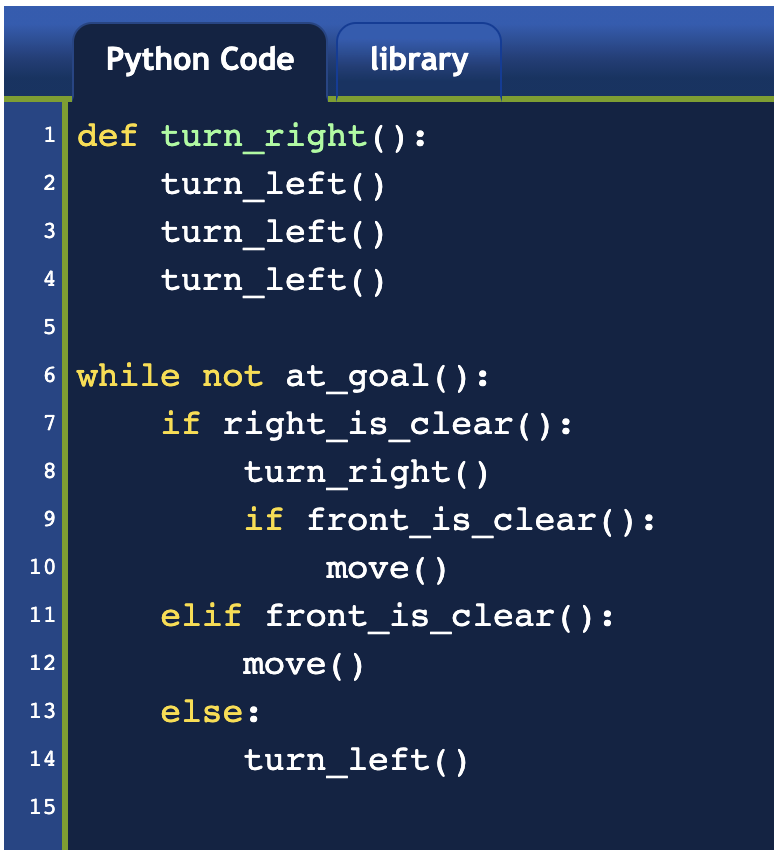

# Day 6 : Escape the Maze

Create a set of functions that help the robot to escape the maze!

https://reeborg.ca/reeborg.html?lang=en&mode=python&menu=worlds%2Fmenus%2Freeborg_intro_en.json&name=Maze&url=worlds%2Ftutorial_en%2Fmaze1.json

## My Solution

## Today's Takeaway

- def function_name () = function functionName ()
- Python makes you to use 4 space for the indentation
- https://www.python.org/dev/peps/pep-0008/#indentation
- while condition: = while (condition) {}
- To invoke a function, you can simply type the name of the function and () following. same as JavaScript.
